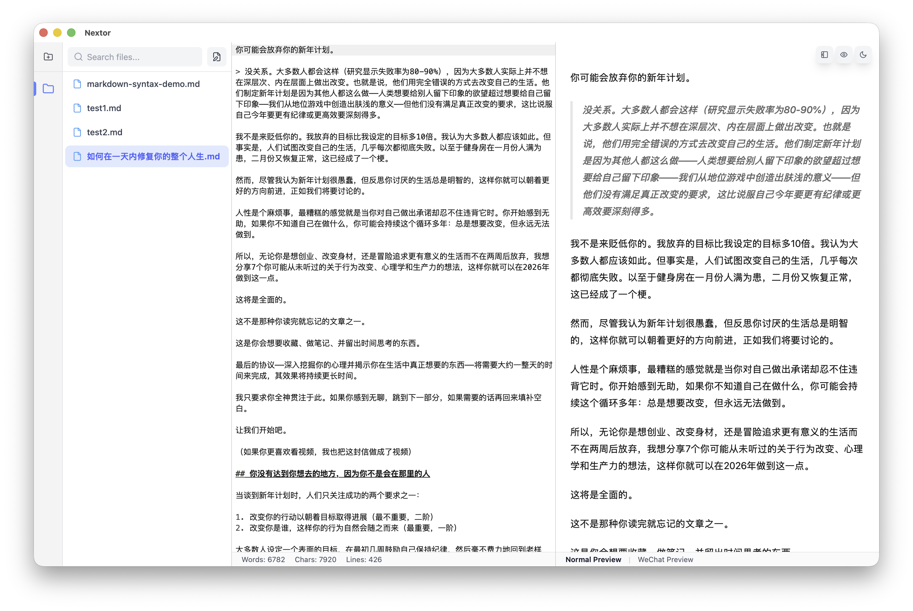

# Nextor

<p align="center">
  
</p>

<p align="center">
  <strong>一款基于 Tauri v2 构建的现代化、功能丰富的 Markdown 编辑器</strong>
</p>

<p align="center">
  专为追求简洁而强大写作环境的作者和开发者设计。
</p>

## 功能特性

### 微信公众号一键导出（核心亮点）

Nextor 提供专业的微信公众号导出功能，内置 **7 种精美主题**：

- **简约 (Minimal)** - 简洁纯净的设计风格
- **多彩 (Colorful)** - 鲜艳色彩，醒目标题
- **深色 (Dark)** - 护眼深色主题
- **优雅 (Elegant)** - 经典衬线字体
- **现代 (Modern)** - 现代卡片式布局
- **商务 (Business)** - 专业商务风格
- **技术 (Tech)** - 开发者专用设计

**导出方式：**
- 一键复制富文本到剪贴板，直接粘贴到微信公众号编辑器
- 保存为独立 HTML 文件，内联 CSS 样式
- 微信预览模式，实时预览最终效果

### 核心编辑功能

- **语法高亮** - 由 highlight.js 提供支持的精美代码块
- **实时预览** - 分屏视图和滚动同步的实时 Markdown 预览
- **查找替换** - 支持区分大小写和正则表达式的强大搜索 (`Cmd+F`)
- **状态栏** - 字数、字符数和行数统计
- **自动保存** - 自动保存会话，永不丢失工作内容

### Markdown 支持

- **GitHub Flavored Markdown** - 完整的 GFM 支持，包括表格、任务列表和删除线
- **数学公式** - 通过 KaTeX 渲染 LaTeX 公式（行内 `$...$` 和块级 `$$...$$`）
- **图表** - 支持 Mermaid 图表，主题自适应渲染
- **代码高亮** - 支持 100+ 种编程语言的语法高亮
- **Wiki 链接** - 使用 `[[wiki 风格]]` 链接在文件间导航
- **内部链接** - 平滑滚动到脚注和章节

### 视图模式

- **仅编辑** - 专注写作模式 (`Cmd+3`)
- **仅预览** - 纯阅读模式
- **分栏视图** - 编辑和预览并排显示
- **演示模式** - 将 Markdown 显示为幻灯片 (`Cmd+4`)
- **目录导航** - 自动生成的目录侧边栏 (`Cmd+5`)

### 导出格式

- **微信公众号** - 7 种主题模板，内联 CSS 样式
- **HTML** - 带有嵌入样式的独立 HTML 文件
- **PDF** - A4 格式，使用 html2canvas 和 jsPDF

### 文件管理

- **文件资源管理器** - 内置文件夹树导航
- **多文件夹支持** - 同时打开和管理多个文件夹
- **文件操作** - 创建、删除和搜索文件
- **会话持久化** - 自动恢复打开的文件和文件夹

### 主题与国际化

- **主题** - 支持浅色、深色和跟随系统主题
- **语言** - 简体中文和英文

## 安装

### 前置要求

- **Node.js** 18+ 和 **pnpm**
- **Rust** 和 Cargo（用于 Tauri）

### 从源码安装

```bash
# 克隆仓库
git clone https://github.com/orechou/nextor.git
cd nextor

# 安装依赖
pnpm install

# 启动开发服务器
pnpm tauri dev
```

### 构建发布版本

```bash
# 构建生产版本
pnpm build
```

构建的应用程序位于 `src-tauri/target/release/bundle/`。

## 使用指南

### 文件操作

| 操作 | 菜单 | 快捷键 |
|------|------|--------|
| 新建文件 | `文件 > 新建` | `Cmd+N` |
| 打开文件 | `文件 > 打开` | `Cmd+O` |
| 打开文件夹 | `文件 > 打开文件夹` | `Cmd+Shift+O` |
| 保存文件 | `文件 > 保存` | `Cmd+S` |
| 另存为 | `文件 > 另存为` | `Cmd+Shift+S` |

### 视图模式

| 操作 | 快捷键 |
|------|--------|
| 切换文件夹树 | `Cmd+1` |
| 切换文件列表 | `Cmd+2` |
| 循环切换视图模式 | `Cmd+3`（循环：编辑 → 预览 → 分栏） |
| 演示模式 | `Cmd+4` |
| 切换目录 | `Cmd+5` |

### 导出到微信公众号

1. 点击 `文件 > 导出 > 微信公众号` 或按 `Cmd+E`
2. 从 7 种可用主题中选择一个
3. 选择是否包含文章标题
4. 点击"复制到剪贴板"，然后粘贴到微信公众号编辑器

### 键盘快捷键

| 快捷键 | 功能 |
|--------|------|
| `Cmd+N` | 新建文件 |
| `Cmd+O` | 打开文件 |
| `Cmd+S` | 保存文件 |
| `Cmd+Shift+S` | 另存为 |
| `Cmd+Shift+O` | 打开文件夹 |
| `Cmd+Shift+W` | 关闭文件夹 |
| `Cmd+E` | 导出（微信公众号） |
| `Cmd+Shift+E` | 导出 HTML |
| `Cmd+Shift+P` | 导出 PDF |
| `Cmd+F` | 查找 |
| `Cmd+Shift+F` | 查找替换 |
| `Cmd+1` | 切换文件浏览器 |
| `Cmd+2` | 切换文件列表 |
| `Cmd+3` | 循环切换视图模式（编辑 → 预览 → 分栏） |
| `Cmd+4` | 切换演示模式 |
| `Cmd+5` | 切换目录 |
| `Cmd+,` | 打开设置 |
| `Cmd+Shift+T` | 跟随系统主题 |
| `Cmd+Shift+L` | 浅色主题 |
| `Cmd+Shift+D` | 深色主题 |
| `Cmd+Option+I` | 切换开发者工具 |

## 技术栈

### 前端

- **React 19** - UI 框架
- **TypeScript** - 类型安全
- **Vite** - 构建工具
- **Tailwind CSS v4** - 样式
- **shadcn/ui** - UI 组件
- **CodeMirror 6** - 代码编辑器
- **react-markdown** - Markdown 渲染
- **KaTeX** - 数学公式渲染
- **Mermaid** - 图表渲染

### 后端

- **Rust** - 系统编程
- **Tauri v2** - 桌面应用框架
- **Tokio** - 异步运行时

## 开发

```bash
# 安装依赖
pnpm install

# 启动开发服务器
pnpm tauri dev

# 类型检查
pnpm tsc --noEmit

# 构建生产版本
pnpm build
```

## 许可证

[MIT](LICENSE) - Copyright (c) 2025 Nextor Contributors

## 贡献指南

欢迎贡献！请随时提交 Pull Request。

1. Fork 本仓库
2. 创建你的特性分支 (`git checkout -b feature/amazing-feature`)
3. 提交你的更改 (`git commit -m 'Add some amazing feature'`)
4. 推送到分支 (`git push origin feature/amazing-feature`)
5. 开启 Pull Request

## 开发路线

- [ ] 拼写检查
- [ ] Vim 按键绑定
- [ ] 更多导出格式（DOCX、EPUB）
- [ ] 云存储集成
- [ ] 协作功能
- [ ] 插件系统

## 致谢

构建于以下开源项目之上：

- [Tauri](https://tauri.app/) - 基于 Rust 的桌面应用框架
- [React](https://react.dev/) - UI 库
- [CodeMirror](https://codemirror.net/) - 代码编辑器
- [shadcn/ui](https://ui.shadcn.com/) - UI 组件
